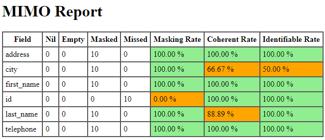

[](https://goreportcard.com/report/github.com/cgi-fr/mimo)


# MIMO : Masked Input Metrics Output

Measure the quality of a pseudonymization transformation by masking.

MIMO will compute the following indicators for each columns :

- masking rate : percentage of values actually masked; ignoring null or inexisting values in real data
- coherent rate : percentage of real unique values that are masked coherently (the same single pseudonym is used for each distinct real value)
- identifiant rate : percentage of unique pseudonyms that are attributed to a single real value

The result is a HTML report that contains the computed indicators for each column.



## Usage

### Real time usage

```console
> mkfifo real.jsonl # create a pipe file to store the real json stream before pseudonymization
> lino pull prod | tee real.jsonl | pimo | mimo real.jsonl | lino push dev
8:27AM WRN field is not completely masked fieldname=surname
> rm real.jsonl # pipe file can be removed after
```

Here is a single command that run an example on synthesized data (require PIMO) :

```bash
pimo --empty-input --repeat 1000 --mask 'name=[{add:""},{randomChoiceInUri:"pimo://nameFR"}]' | tee real.jsonl | pimo --mask 'name={randomChoiceInUri:"pimo://nameFR"}' | mimo real.jsonl
```

### After process usage

MIMO can also be used on existing file on disk.

```console
> cat masked.jsonl | mimo real.jsonl
```

### Configuration

Here is an example configuration file.

```yaml
version: "1"
metrics:
  - name: "name"           # required : name of the column to configure
    exclude: [""]          # optional : these values will be ignored during computation of the masking rate
    coherentWith: ["name"] # optional : which values to use for the computation of the coherent rate
    constraints:           # optional : list of constraints to validate at the end of the execution
      maskingRate:
        shouldEqual: 1
      coherentRate:
        shouldBeGreaterThan: 0.5
```

You need to inform MIMO of this configuration file with the `--config` flag :

```console
> cat masked.jsonl | mimo --config myconfig.yaml real.jonsl
```

## Contributing

Pull requests are welcome. For major changes, please open an issue first to discuss what you would like to change.

## License

[MIT](https://choosealicense.com/licenses/mit/)
