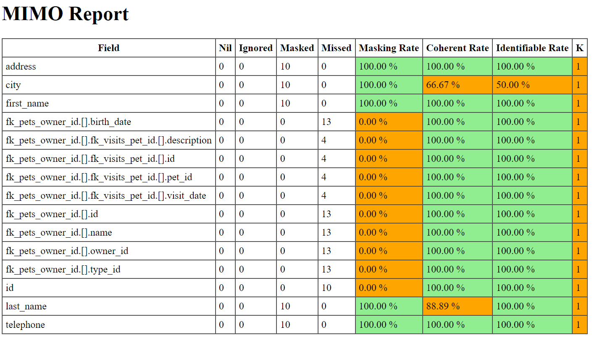

[](https://goreportcard.com/report/github.com/cgi-fr/mimo)


# MIMO : Masked Input Metrics Output

Measure the quality of a pseudonymization transformation by masking.

MIMO will compute the following indicators for each columns :

- masking rate : percentage of values actually masked; ignoring null or inexisting values in real data
- coherent rate : percentage of real unique values that are masked coherently (the same single pseudonym is used for each distinct real value)
- identifiant rate : percentage of unique pseudonyms that are attributed to a single real value

The result is a HTML report that contains the computed indicators for each column.



## Usage

### Real time usage

```console
> mkfifo real.jsonl # create a pipe file to store the real json stream before pseudonymization
> lino pull prod | tee real.jsonl | pimo | mimo real.jsonl | lino push dev
8:27AM WRN field is not completely masked fieldname=surname
> rm real.jsonl # pipe file can be removed after
```

Here is a single command that run an example on synthesized data (require PIMO) :

```bash
pimo --empty-input --repeat 1000 --mask 'name=[{add:""},{randomChoiceInUri:"pimo://nameFR"}]' | tee real.jsonl | pimo --mask 'name={randomChoiceInUri:"pimo://nameFR"}' | mimo real.jsonl
```

### After process usage

MIMO can also be used on existing file on disk.

```console
> cat masked.jsonl | mimo real.jsonl
```

### Configuration

Here is an example configuration file.

```yaml
version: "1"
metrics:
  - name: "name"               # required : name of the column to configure
    alias: "alias"             # optional : replace name of the column by this alias in report
    exclude: [""]              # optional : these values will be ignored during computation of the masking rate
    coherentWith: ["name"]     # optional : which values to use for the computation of the coherent rate
    coherentSource: "template" # optional : additional coherence source to compute
    constraints:               # optional : list of constraints to validate at the end of the execution
      maskingRate:
        shouldEqual: 1
      coherentRate:
        shouldBeGreaterThan: 0.5
```

You need to inform MIMO of this configuration file with the `--config` flag :

```console
> cat masked.jsonl | mimo --config myconfig.yaml real.jonsl
```

Available constraints targets are :

- `maskingRate` : define a constraint on the masking rate
- `coherentRate` : define a constraint on the cohenrent rate
- `identifiantRate` : define a constraint on the identifiant rate

Available constraints types are :

- `shouldEqual`
- `shouldBeGreaterThan`
- `shouldBeGreaterThanOrEqualTo`
- `shouldBeLowerThan`
- `shouldBeLessThanOrEqualTo`

#### About the `coherentSource` template

The `coherentSource` configuration is a [Go template](https://pkg.go.dev/text/template) with [additional utility functions](http://masterminds.github.io/sprig/strings.html).

You can see an example of how to use `coherentSource` [here](test/configs/config_template.yaml).

The template context (`.`) will be set to the root object.

To create a `coherentSource` relative to the current value being analysed (e.g. in a nested array), you can use the `Stack <index>` function :

- `Stack 0` will return the current value
- `Stack -1` will return the parent of the current value
- `Stack -2`, `Stack -3`, ... will return each ancestor of the current value up to the root object
- `Stack 1` will return the farthest ancestor (before the root value) of the current value
- `Stack 2`, `Stack 3`, ... will return each farthest ancestor of the current value up to the parent of the current value

### Persistent run

By default all computation happen in memory, which means 2 runs will always be independent.

By using the `--persist <folder>` parameter, the computation can be persisted on disk, and retrieved by another execution of mimo.

This can enable inter-stream coherent/identifiant analysis.

The `--disk-storage` flag on the other hand will enable computation on disk but a second runs with the same flag will stay be independent. It is usefull is there is not enough memory ressource on the environment.

### Pre-processing

In rare cases, you might have to create a field before running an analysis with MIMO.

This can happens for example when you want to measure coherence between two stream with different formatting of data. This [this issue](https://github.com/CGI-FR/MIMO/issues/20) for reference.

To create a field before analysis of data, you can use the `preprocess` parameter.

```yaml
version: "1"
preprocess:                                   # optional : list of fields to preprocess
  - name: "idutil"                            # name of the field (can be nested with jsonpath notation)
    value: "{{.id}} - {{.name}} {{.surname}}" # template to compute the value of the field
metrics:
  - name: "idutil"              # you can use preprocessed fields in the rest of the configuration
    coherentWith: ["id"]
```

The template used to create the `value` has the same capabilities as the `coherentSource` template.

## Contributing

Pull requests are welcome. For major changes, please open an issue first to discuss what you would like to change.

## License

[GPLv3](https://choosealicense.com/licenses/gpl-3.0/)

Copyright (C) 2023 CGI France

MIMO is free software: you can redistribute it and/or modify
it under the terms of the GNU General Public License as published by
the Free Software Foundation, either version 3 of the License, or
(at your option) any later version.

MIMO is distributed in the hope that it will be useful,
but WITHOUT ANY WARRANTY; without even the implied warranty of
MERCHANTABILITY or FITNESS FOR A PARTICULAR PURPOSE.  See the
GNU General Public License for more details.

You should have received a copy of the GNU General Public License
 along with MIMO.  If not, see <http://www.gnu.org/licenses/>.
